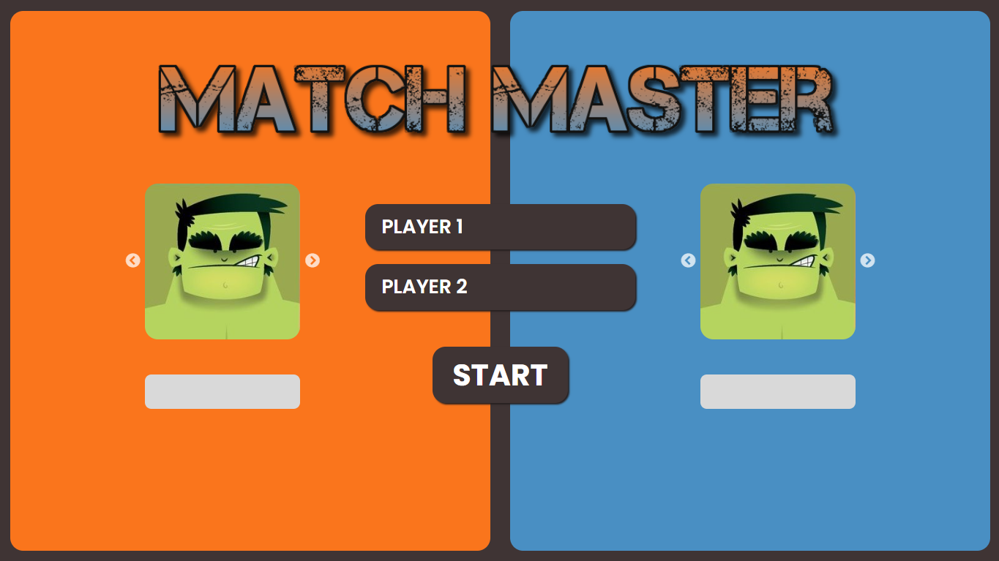

# Match Master

A fun and interactive card-matching game where players flip cards to find matching pairs, earn points, and compete to score the highest total.

## Live Demo
🔗 [Demo Link](https://adityarajbind.github.io/match-master/)

## Screenshots


## Tech Stack
- React
- Tailwind CSS
- JavaScript (ES6+)
- Vite

## Purpose of This Project
This project was built to practice:
- Game logic implementation in React
- State management for turn-based systems
- Conditional rendering and animations
- Component-based architecture
- Handling user interactions effectively

## Installation

```bash
git clone https://github.com/Adityarajbind/match-master.git
cd match-master
npm install
npm run dev
